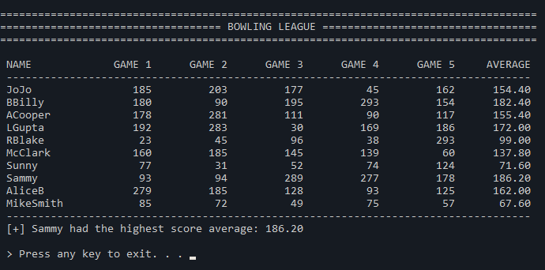
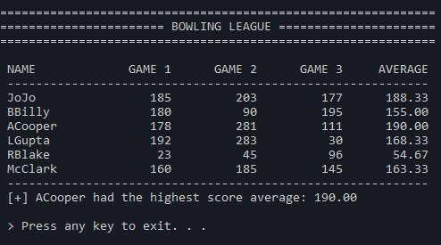

# Description 
This program calculates the average bowling scores of a bowling league. It reads data from a file and displays the results in a formatted table.



---
- The default file name is **BowlingScores.txt**. You can change the file name from main()
```c++
const string FILE_NAME = "BowlingScores.txt";
```
- The file format must be as follows: Name1 score1 score2 score3 score4 score5
- The output format is flexible depending on how many players and scores per player are in the file
- You can change the number of players and the scores per player the program should expect from the file by changing the global constant variables values.

```c++
// GLOBAL CONSTANT VARIABLES
const int NUMBER_OF_BOWLERS = 6;   // change depending on how many players are in the file.
const int GAME_ROUNDS = 3;         // change depending on how many scores per player are in the file.
```



